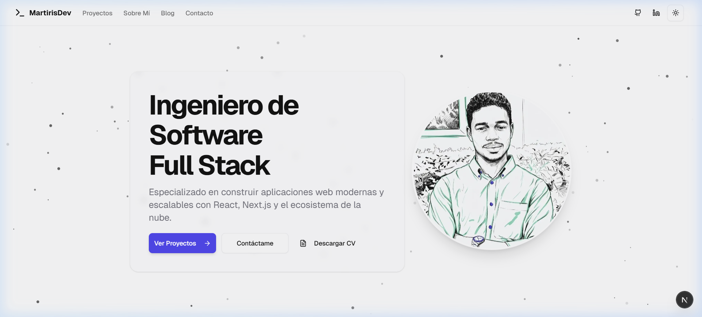
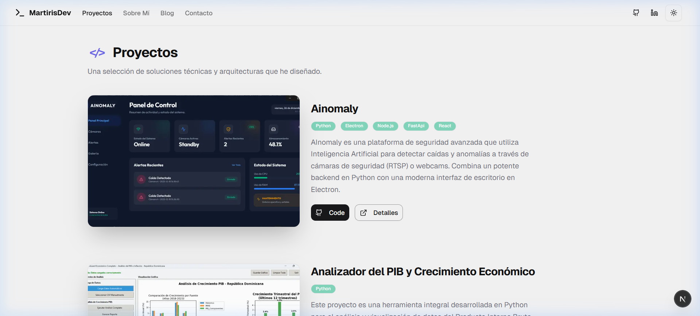
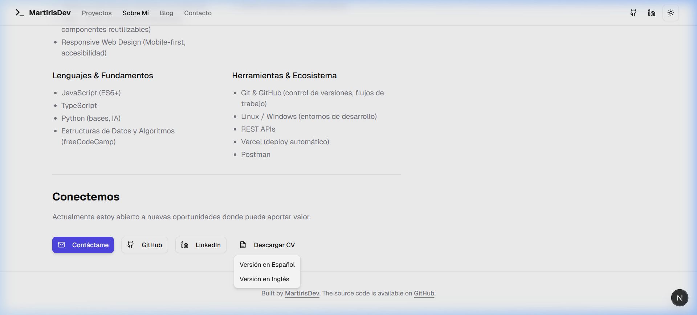
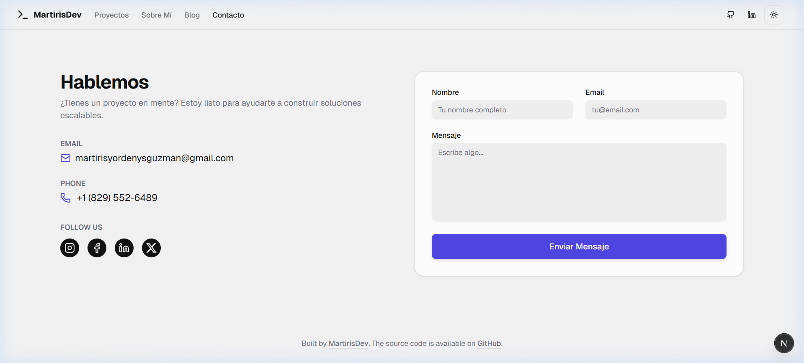

# MartirisDev - Portafolio Profesional

Bienvenido a mi portafolio personal. Este es un espacio donde comparto mi trayectoria como Ingeniero de Software, mis proyectos más destacados y mis conocimientos técnicos. El sitio está diseñado con un enfoque en la modernidad, la velocidad y la experiencia de usuario premium.



## 🚀 Características y Funcionalidades

- **Diseño Moderno y Adaptativo:** Una interfaz limpia y profesional que se ajusta perfectamente a dispositivos móviles y de escritorio.
- **Sección de Proyectos Rediseñada:** Visualización horizontal de proyectos con un enfoque visual impactante, incluyendo detalles técnicos y enlaces directos a código y demostraciones.
- **Descarga de CV Bilingüe:** Menú desplegable integrado tanto en la página de inicio como en "Sobre Mí" para descargar mi CV en español o inglés.
- **Filtro de Proyectos y Contenido:** Organización eficiente de proyectos mediante etiquetas y categorías.
- **Optimización de Traducción:** El sitio utiliza español estático como base para garantizar la mejor compatibilidad con los traductores automáticos de los navegadores modernos.
- **Modo Oscuro/Claro:** Soporte completo para temas visuales que se adaptan a la preferencia del usuario.

## 🛠️ Tecnologías y Arquitectura

Este proyecto fue construido utilizando herramientas de vanguardia para garantizar escalabilidad y rendimiento:

- **Framework:** [Next.js 16](https://nextjs.org/) (App Router, Server Components y Turbopack).
- **Lenguaje:** [TypeScript](https://www.typescriptlang.org/) para un desarrollo robusto y seguro.
- **Estilos:** [Tailwind CSS](https://tailwindcss.com/) para un diseño ágil y altamente personalizable.
- **Componentes UI:** [Shadcn UI](https://ui.shadcn.com/) sobre Radix Primitives.
- **Animaciones:** [Framer Motion](https://www.framer.com/motion/) para micro-interacciones suaves.
- **Backend:** [Supabase](https://supabase.com/) como base de datos y gestión de contenido.
- **Seguridad:** Actualización constante de dependencias (como `next-mdx-remote`) para mitigar vulnerabilidades.

### Por qué esta Stack?
Elegí **Next.js** por su excelente manejo del SEO gracias al Server-Side Rendering (SSR) y su velocidad de carga. **Tailwind CSS** permite una consistencia visual sin sacrificar el rendimiento, mientras que **Supabase** ofrece una infraestructura backend flexible que me permite centrarme en el frontend.

## 📁 Estructura del Proyecto

```text
src/
├── app/            # Rutas de Next.js (App Router)
├── components/     # Componentes de UI y lógica reutilizable
│   ├── ui/         # Componentes base (shadcn)
│   ├── layout/     # Componentes globales (Navbar, Footer)
│   └── features/   # Componentes específicos por funcionalidad
├── lib/            # Utilidades y configuración de clientes (Supabase)
├── types/          # Definiciones de TypeScript para la base de datos
└── public/         # Recursos estáticos (Imágenes, PDFs, CVs)
```

## 📸 Galería del Proyecto

### Proyectos Destacados


### Sobre Mí y Arsenal Técnico


### Contacto


## 🛠️ Instalación Local

1. Clona el repositorio:
   ```bash
   git clone https://github.com/MartirisYordenisGuzman/Portfolio.git
   ```
2. Instala las dependencias:
   ```bash
   npm install
   ```
3. Ejecuta el servidor de desarrollo:
   ```bash
   npm run dev
   ```
4. Abre [http://localhost:3000](http://localhost:3000) en tu navegador.

---
Construido con ❤️ por [Martiris Guzman](https://www.linkedin.com/in/martiris-yordenis-guzmán)
