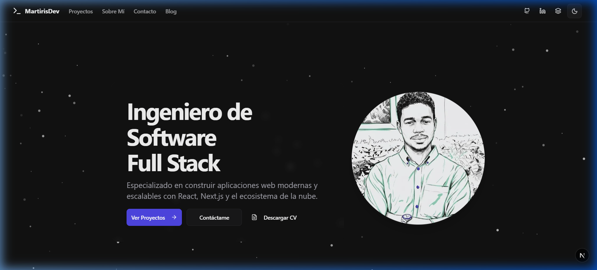
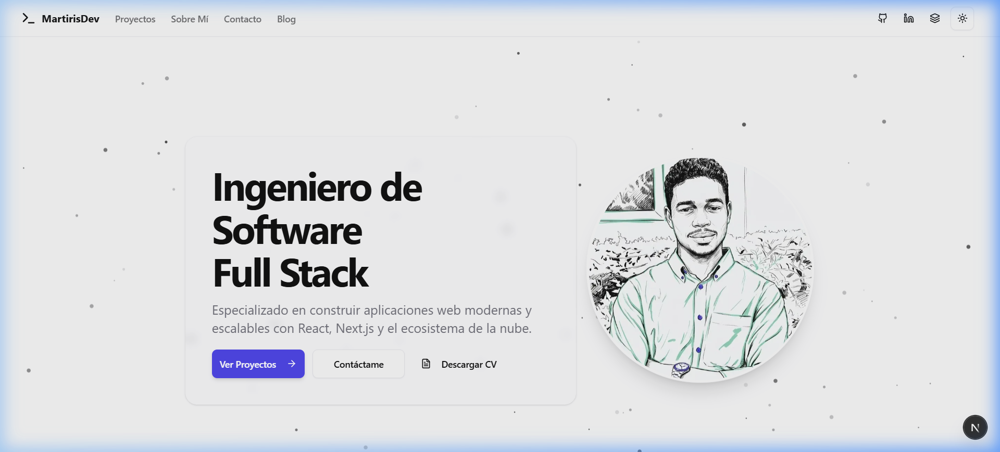
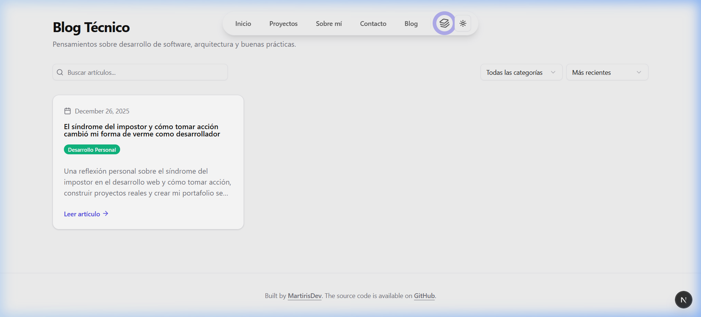
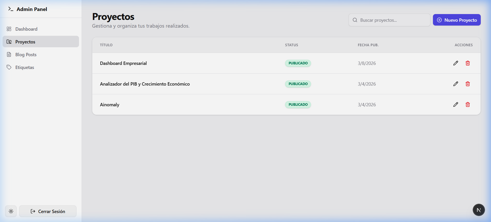
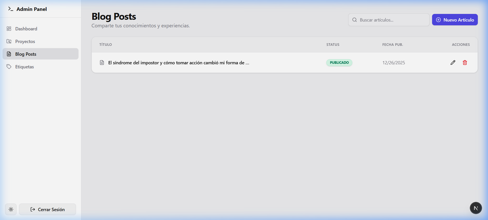

# MartirisDev - Portafolio Profesional

Bienvenido a mi portafolio personal. Este es un espacio donde comparto mi trayectoria como Ingeniero de Software, mis proyectos más destacados y mis conocimientos técnicos. El sitio está diseñado con un enfoque en la modernidad, la velocidad y la experiencia de usuario premium.



## 🚀 Características y Funcionalidades

- **Doble Modo de Navegación (Layout Toggle):** Única funcionalidad que permite al usuario alternar instantáneamente entre una experiencia **Single Page Application (SPA)** con scrolls suaves y una estructura **Multi-página** tradicional, manteniendo el estado de la aplicación.
- **Diseño Moderno y Adaptativo:** Interfaz limpia y profesional que utiliza Tailwind v4 para una visualización perfecta en cualquier dispositivo.
- **Modo Oscuro/Claro Nativo:** Soporte completo para temas visuales que se adaptan a la preferencia del sistema o del usuario mediante un toggle intuitivo.
- **Sección de Proyectos Dinámica:** Visualización de proyectos con filtrado por tecnologías y una galería de imágenes integrada para una inspección detallada.
- **Panel de Administración Robusto:** Dashboard privado para gestionar proyectos, artículos del blog y etiquetas sin necesidad de modificar el código.
- **Descarga de CV Bilingüe:** Acceso rápido a versiones de mi currículum en español e inglés.

## 🛠️ Tecnologías y Arquitectura

Este proyecto utiliza el stack más moderno para garantizar el mejor rendimiento:

- **Framework:** [Next.js 16](https://nextjs.org/) (App Router & Turbopack).
- **Animaciones:** [Framer Motion](https://www.framer.com/motion/) para transiciones y el efecto de pulso sincronizado en el toggle de layout.
- **Estilos:** [Tailwind CSS v4](https://tailwindcss.com/) nativo.
- **Componentes:** [Shadcn UI](https://ui.shadcn.com/) y Radix Primitives.
- **Backend & Auth:** [Supabase](https://supabase.com/).

---

## ⚡ Experiencia de Usuario: Layout Toggle

Una de las características principales de este portafolio es el botón de **Layout Mode**. Ubicado en la barra de navegación, permite cambiar la lógica de navegación del sitio:

1. **Modo SPA:** Navegación fluida dentro de la misma página, ideal para una lectura rápida y lineal.
2. **Modo Clásico:** Rutas separadas para cada sección, mejorando el SEO y permitiendo compartir enlaces específicos.


*Icono de capas animado indicando la disponibilidad del cambio de modo.*

---

## 📁 Estructura del Proyecto

```text
src/
├── app/            # Rutas y páginas de Next.js (Admin, Blog, Projects)
├── components/     # Arquitectura de componentes
│   ├── features/   # Lógica específica (Home, Projects, Admin, Blog)
│   ├── layout/     # Navbar, SpaNavbar y Footer unificados
│   └── ui/         # Componentes base altamente personalizables
├── lib/            # Utilidades y Supabase Client
│   ├── api/        # Funciones de consulta a la base de datos
│   └── data/       # Información estática y metadatos
├── providers/      # Contextos (Theme, LayoutMode, QueryClient)
├── types/          # Tipados compartidos y esquemas de base de datos
└── public/         # Activos estáticos, CVs y Capturas
```

## 📸 Galería del Sitio

### Interfaz Principal
| Modo Claro | Modo Oscuro |
|------------|-------------|
|  |  |

### Sección de Blog

*Explora mis artículos técnicos con filtrado dinámico.*

### Panel Administrativo (Gestión Completa)
El portafolio incluye un área privada para el control total del contenido:

| Dashboard Principal | Gestión de Proyectos |
|---------------------|----------------------|
|  |  |

| Gestión de Blog |
|-----------------|
|  |

---

## 🛠️ Instalación y Uso

1. **Clonar:** `git clone https://github.com/MartirisYordenisGuzman/Portfolio.git`
2. **Instalar:** `npm install`
3. **Variables:** Configurar `.env.local` con `NEXT_PUBLIC_SUPABASE_URL` y `NEXT_PUBLIC_SUPABASE_ANON_KEY`.
4. **Desarrollo:** `npm run dev`

---
Construido con ❤️ por [Martiris Guzman](https://www.linkedin.com/in/martiris-yordenis-guzmán)
